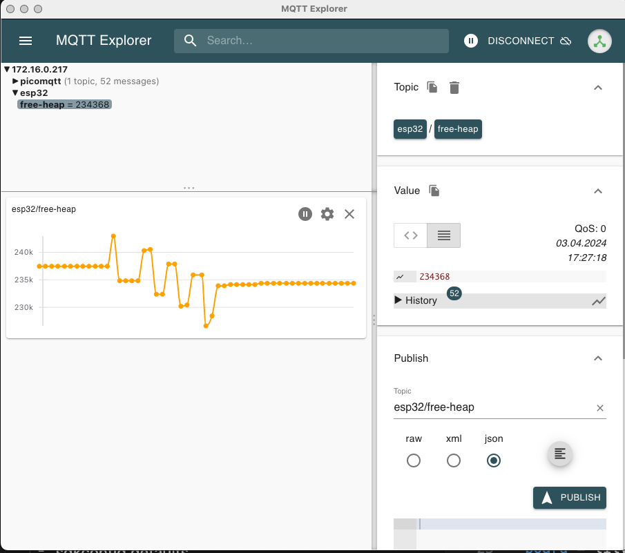
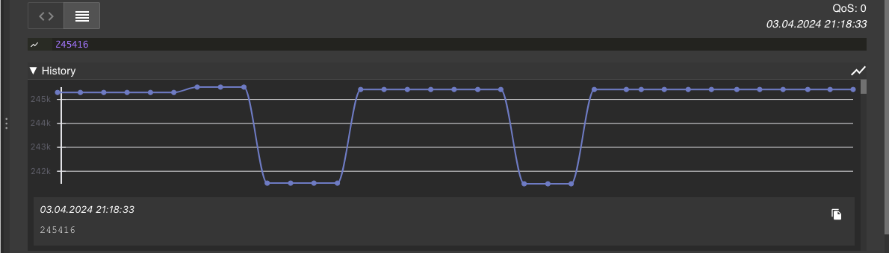

# Websockets support for PicoMQTT

[PicoMQTT](https://github.com/mlesniew/PicoMQTT) is a great embedded MQTT broker which at this time supports MQTT-over-TCP.

I have a need to support [MQTT-over-websockets with PicoMQTT](https://github.com/mlesniew/PicoMQTT/issues/28) - while this is in the works, this repo provides a stopgap solution to support MQTT-over-Websockets to PicoMQTT as it stands.

The idea is simple - run a [Websockets-to-TCP proxy](src/ProxyWebSocketsServer.h) in a thread, then connect to PicoMQTT over TCP. PicoMQTT required a [minor change](https://github.com/mhaberler/PicoMQTT/commit/f3c85fc7b8b414d561a7814e12f1e7c88d39ee5f) to support this. This is suboptimal as resource usage and speed goes, but it gets things going.

## ESP32 demo broker and publisher

The wsbroker Platformio example contains:

- a web server on port 80
- the PicoMQTT broker on port 1883 (TCP)
- the PicoMQTT broker on port 8883 (Websockets)
- an MDNS publisher announcing the _http._tcp, _mqtt._tcp and _mqtt-ws._tcp services
- an internal publisher which publishes the CPU temperature to a topic like 'picomqtt/esp-DC:54:75:C8:C0:68' (including the MAC address).

## Clients

- [MQTT.js web client](data/mqtt.htm): connect to  http://broker.local/mqtt.htm
- [Paho JS web client](data/paho.htm): connect to  http://broker.local/paho.htm
- MQTT.js [node client](nodejs/mqtt_js_publisher.js)
- Python/Eclipse Paho websockets [publisher](python/publish.py) and [subscriber](python/subscribe.py)

The nodejs and Python clients resolve the broker IP address via MDNS as announced by the esp32 example.

### Other clients tested

verified to work:

* MQTT-Explorer 0.3.5
* MQTTX v1.9.9

# tracking heap usage with MQTT explorer

turns out there is a memory leak, probably in the proxy - this was during a few connects and disconnects with a second client (MQTTX)

each disconnect looses about 2.2-2.6kB of heap:

this does not happen when connecting to / disconnecting from the TCP port:

